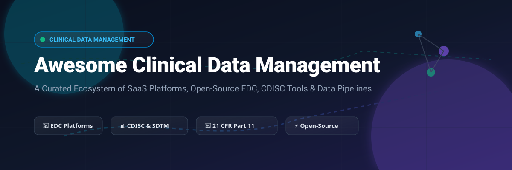

# 🏥 Awesome Clinical Data Management 📊

  
  
  
  
  

**A Curated List of SaaS Platforms & Open-Source GitHub Projects for Clinical Data Management (CDM), Electronic Data Capture (EDC), CDISC Standards & Regulatory Submissions.**

---

## 📑 Table of Contents
- [🌐 Ecosystem & Market Overview](#-ecosystem--market-overview)
- [🏢 SaaS/Hosted CDM & EDC Platforms](#-saashosted-cdm--edc-platforms)
- [⚡ Open-Source GitHub Projects](#-open-source-github-projects)
- [🛠️ Developer Tools & Frameworks](#%EF%B8%8F-developer-tools--frameworks)
- [🤝 How to Contribute](#-how-to-contribute)
- [💖 Support & Sponsorship](#-support--sponsorship)
- [📈 Star History](#-star-history)
- [⚖️ Disclaimer](#%EF%B8%8F-disclaimer)

---

## 🌐 Ecosystem & Market Overview

Clinical Data Management (CDM) systems enable biopharmaceutical companies, Contract Research Organizations (CROs), academic institutions, and medical centers to capture, clean, validate, transform, and store clinical trial patient data while adhering to **21 CFR Part 11**, **ICH-GCP**, and **CDISC standards (SDTM, ADaM, ODM-XML)**.

📈 **Market Analysis**: The global Clinical Data Management System (CDMS) market is estimated at **$2.4 Billion (2026)** and is projected to reach **$4.8 Billion by 2032** (CAGR of ~12.2%). The sector exhibits **moderate market concentration** led by enterprise giants (Oracle, Medidata, Veeva), while maintaining an active long-tail of specialized cloud platforms and vibrant open-source alternatives suited for academic research and decentralized clinical trials (DCTs).

---

## 🏢 SaaS/Hosted CDM & EDC Platforms

Below is a comparison of commercial SaaS and cloud-hosted clinical data management platforms, ordered by **Company Size (Revenue / Valuation) in descending order**:

| Platform / Product | Company Size (Valuation / Revenue) 💰 | Pricing (Starting Tier) 💵 | Free Tier / Trial Limits 🎁 | Key Capabilities 🛠️ |
| :--- | :--- | :--- | :--- | :--- |
| **[Oracle Clinical One](https://www.oracle.com/life-sciences/clinical-research/clinical-one/)** | **~$480B Valuation** *(~$53B Revenue)* | Starts at **~$1,500/month** per study | **30-day guided sandbox** demo environment upon sales request | End-to-end cloud platform unifying EDC, RTSM, CTMS, and real-time trial analytics. |
| **[Macro EDC (RELX/Elsevier)](https://www.elsevier.com/solutions/macro)** | **~$80B Valuation** *(~$11B Revenue)* | Starts at **~$1,200/month** per protocol | **14-day evaluation access** upon institutional request | High-security EDC platform with CDISC export, complex form rules, and trial auditing. |
| **[Medidata Rave EDC](https://www.medidata.com/en/products/rave-edc/)** | **~$50B Valuation** *($5.8B acquisition; ~$750M Rev)* | Starts at **~$2,500/month** per study site | **No free trial** *(30-day sandbox via Medidata Academy)* | Industry standard for enterprise CROs/Sponsors, Rave RTSM, and cloud data capture. |
| **[Veeva Vault CDMS](https://www.veeva.com/products/vault-cdms/)** | **~$45.5B Valuation** *(~$3.2B Revenue)* | Starts at **~$2,000/month** per study site | **No free trial** *(custom live sandbox demo on request)* | Modern cloud-native EDC, data coding, eTMF integration, and submission-ready datasets. |
| **[Clario EDC](https://clario.com/)** | **~$3.5B Valuation** *(~$800M Revenue)* | Starts at **~$1,500/month** per study | **14-day preview environment** for qualified sponsors | Specialized clinical endpoint data collection, eCOA/ePRO, cardiac safety, and imaging data. |
| **[IBM Clinical Development (Merative)](https://www.merative.com/clinical-development)** | **~$1.0B Valuation** *(~$300M Revenue)* | Starts at **~$1,000/month** per deployment | **14-day guided walkthrough** sandbox | Integrated EDC, patient management, electronic questionnaires, and automated CDISC exports. |
| **[Castor EDC](https://www.castoredc.com/)** | **~$150M Valuation** *(~$20M Revenue)* | Starts at **$250/month** (academic center tier) | **Free 30-day trial** *(up to 5 study participants / 10 test forms)* | User-friendly cloud EDC, eConsent, ePRO, decentralized trial modules, and REST API access. |
| **[Ennov Clinical](https://www.ennov.com/clinical-suite/)** | **~$75M Valuation** *(~$15M Revenue)* | Starts at **~$800/month** per protocol | **14-day evaluation demo instance** upon request | Unified EDC, CTMS, eTMF, and regulatory document management suite compliant with GCP. |
| **[ClinCapture](https://www.clincapture.com/)** | **~$20M Valuation** *(~$5M Revenue)* | Starts at **$499/month** (self-service build) | **Free 14-day trial** for study designer & form builder | Validated cloud EDC, self-service form design, CTMS connectors, and offline data capture. |
| **[OpenClinica Enterprise Cloud](https://www.openclinica.com/)** | **~$18M Valuation** *(~$4M Revenue)* | Starts at **$500/month** (small study starter) | **100% Free self-hosted edition** *(or 30-day cloud trial)* | Commercial cloud edition of OpenClinica with drag-and-drop form builder and 21 CFR Part 11 validation. |

---

## ⚡ Open-Source GitHub Projects

The open-source ecosystem for Clinical Data Management offers robust, production-tested solutions. Below is a curated list of active open-source projects, sorted by **GitHub Stars in descending order**:

| Repository / Project | Stars Badge ⭐ *(Clickable)* | Language / Tech Stack | License | Description & Highlights 💡 |
| :--- | :--- | :--- | :--- | :--- |
| **[OpenClinica Community](https://github.com/OpenClinica/OpenClinica)** |  | Java, PostgreSQL | LGPL-2.1 | The original open-source EDC platform. Comprehensive web-based clinical data capture and trial management. |
| **[pharmaverse/admiral](https://github.com/pharmaverse/admiral)** |  | R | Apache-2.0 | Modular R package framework for creating ADaM (Analysis Data Model) datasets in pharmaverse. |
| **[cdisc-org/cdisc-rules-engine](https://github.com/cdisc-org/cdisc-rules-engine)** |  | Python | MIT | Official CDISC rules engine for automated validation of clinical trial data standards. |
| **[reliatec-gmbh/LibreClinica](https://github.com/reliatec-gmbh/LibreClinica)** |  | Java, JSP, PostgreSQL | LGPL-2.1 | Most active open-source successor to OpenClinica 3.x. Production-proven GCP-compliant EDC platform. |
| **[phoenixctms/ctsms](https://github.com/phoenixctms/ctsms)** |  | Java, Spring, GWT | GPL-3.0 | Comprehensive Clinical Trial Management System (CTMS), Patient Recruitment (PRS), and CDMS. |
| **[insightsengineering/random.cdisc.data](https://github.com/insightsengineering/random.cdisc.data)** |  | R | Apache-2.0 | Synthetic CDISC-compliant dataset generator (ADSL, ADAE, ADLB) for testing and pipeline benchmarking. |
| **[pharmaverse/sdtm.oak](https://github.com/pharmaverse/sdtm.oak)** |  | R | Apache-2.0 | EDC-agnostic SDTM data transformation engine automating raw electronic data to CDISC SDTM domains. |
| **[clinicedc/edc](https://github.com/clinicedc/edc)** |  | Python, Django | GPL-3.0 | Modular Django framework for building custom multi-center longitudinal clinical trial EDC applications. |
| **[cdiscbuilder](https://github.com/ishandutta2007/cdiscbuilder)** |  | Python, PyPI | MIT | Configuration-driven Python package converting CDISC ODM XML files directly into SDTM/ADaM datasets. |
| **[hcstubbe/lcarsc](https://github.com/hcstubbe/lcarsc)** |  | R, Shiny, SQLite | MIT | Lightweight EDC system published in *Nature Scientific Reports (2024)* for resource-constrained trial settings. |

---

## 🛠️ Developer Tools & Frameworks

Building custom clinical data processing pipelines? Here is a suggested open-source technology stack:

- **Core EDC & Data Capture**: [LibreClinica](https://github.com/reliatec-gmbh/LibreClinica) or [OpenClinica Community](https://github.com/OpenClinica/OpenClinica) for web-based data entry with audit trail logging.
- **SDTM/ADaM Transformation**: [pharmaverse/sdtm.oak](https://github.com/pharmaverse/sdtm.oak) and [pharmaverse/admiral](https://github.com/pharmaverse/admiral) for R workflows; [cdiscbuilder](https://github.com/ishandutta2007/cdiscbuilder) for Python workflows.
- **Standards Validation**: [cdisc-rules-engine](https://github.com/cdisc-org/cdisc-rules-engine) for validating compliance against CDISC specifications.
- **Synthetic Test Data Generation**: [random.cdisc.data](https://github.com/insightsengineering/random.cdisc.data) for generating mock datasets during development.

---

## 🤝 How to Contribute

Contributions are warmly welcome! Help make this curated list the ultimate resource for clinical trial data tools.

1. **Fork** this repository.
2. Add your tool/project to `README.md` following the table formatting.
3. Ensure description is factual, concise, and linked to official sites/repositories.
4. Submit a **Pull Request (PR)** with a clear title.

Check out our curated list collection at [Awesome-Awesome-Awesome](https://github.com/ishandutta2007/Awesome-Awesome-Awesome)!

---

## 💖 Support & Sponsorship

If you find this repository helpful for your clinical research, data engineering, or health-tech work, please consider supporting the project:

- ⭐ **Star** this repository to increase its visibility.
- 🍴 **Fork** it to keep your own copy and contribute improvements.
- 📢 **Share** it with your colleagues and network in life sciences.
- ☕ **Sponsor** or buy me a coffee via the [GitHub Sponsor Dashboard](https://github.com/sponsors/ishandutta2007)!

Your support is deeply appreciated and helps maintain awesome open-source resources!

---

## 📈 Star History

---

## ⚖️ Disclaimer

- This list is **community-curated** for educational and research purposes.
- Clinical Data Management systems process highly sensitive protected health information (PHI). Always verify system compliance with **21 CFR Part 11**, **ICH-GCP**, **HIPAA**, **GDPR**, and regional regulatory frameworks before deploying software in live clinical trials.
